# 前言

## 原项目介绍

`CPlayer`是一个由`ChKSz`这个没有钱买网易云黑胶VIP的小穷鬼开发的沉浸式免费听高品质网易云音乐的项目。

原项目功能比较简单，可以根据关键词（作者、名称）搜索歌曲并单击即可解析超清母带音质并在线聆听。

## 预览链接

无歌单播放的链接：[CPlayer-Pro-R](https://cp.chksz.top)

我的歌单播放链接：[CPlayer-Pro-P](https://cp-p.chksz.top)

## 项目原理

感谢 @kanxizai 大佬开发的API，为本项目提供技术支持

[API网址](https://api.kxzjoker.cn)

本质是使用会员ck+算法模拟SVIP用户请求并返回播放链接

# 开发

## 原因

首先，我用这个项目的时候主要是因为脑子里有一些旋律或歌曲（当然是记得名字的）

就会打开它去播放。

听完这首歌，感觉心情很舒畅了，就想听下一首。

但是发现脑子里基本不记得什么歌名了就很扫兴。

所以就想把网易云的歌单功能做进来。

## 歌单实现原理

其实也是看到了大佬做的项目起到了一个思路启发的作用，这里放链接。具体教程下面也有的哈。

::github{repo="Baidaidai-GFWD-origin/East-Earth"}

其实有了这个就很简单了，只要有了歌单中歌曲ID的集合，我们只要每次随机抽取等即可。

# 使用教程

## 歌单json获取

1. 首先登录网易云音乐并打开本链接：[我的歌单](https://music.163.com/#/my/)

2. 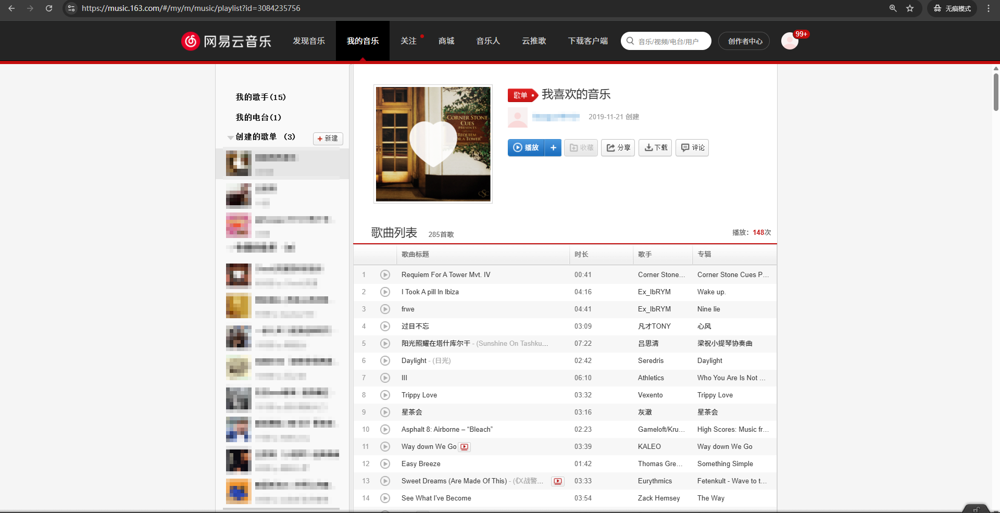
   
   就是一个这样的页面

3. 按下键盘的`F12`按钮进入开发者调试窗口，然后选择`元素`
   
   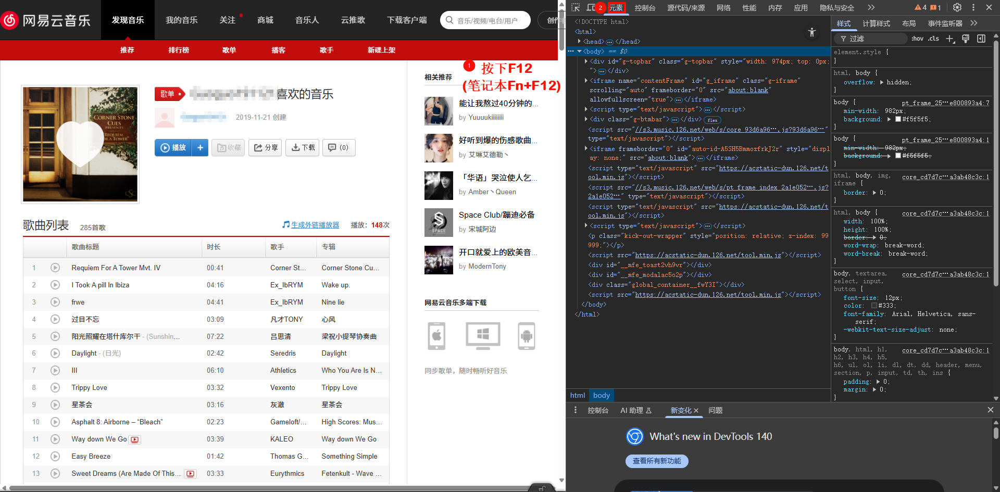

4. 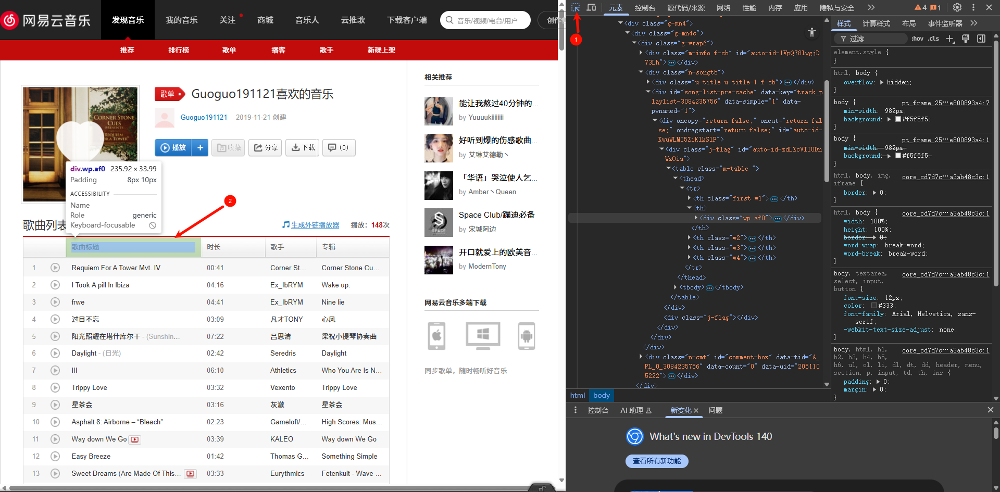
   
   点击选曲然后点击歌曲标题那里，点击一下，右边的代码就会刷新

5. 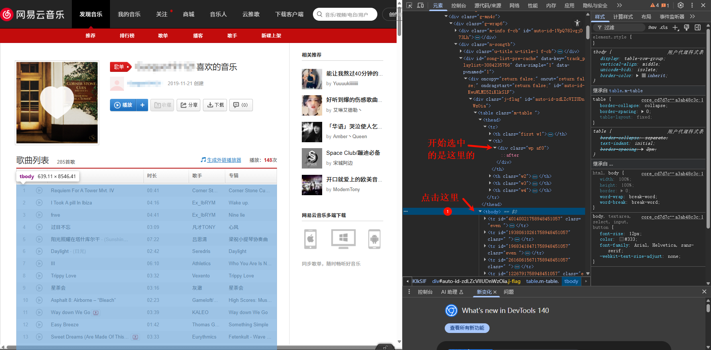

6. 点击控制台然后粘贴代码进去：
   
   ```js
   (function(){
       const rawHTML = $0
       const context = rawHTML.innerHTML
       
       function analyzeMusicList(params) {
           const regexp = /href="\/song\?id=(\d+)"/g;
           const songIDMatches = context.match(regexp);
           if (!songIDMatches) {
               console.log("未找到歌曲 ID。");
               return [];
           }
           const songIDs = songIDMatches.map(match => {
               const matchResult = /href="\/song\?id=(\d+)"/.exec(match);
               return matchResult ? matchResult[1] : null;
           });
           return songIDs;
       }
       
       const result = analyzeMusicList();
       
       console.log(result)
       console.log(result.toString())
   })()
   
   ```
   
   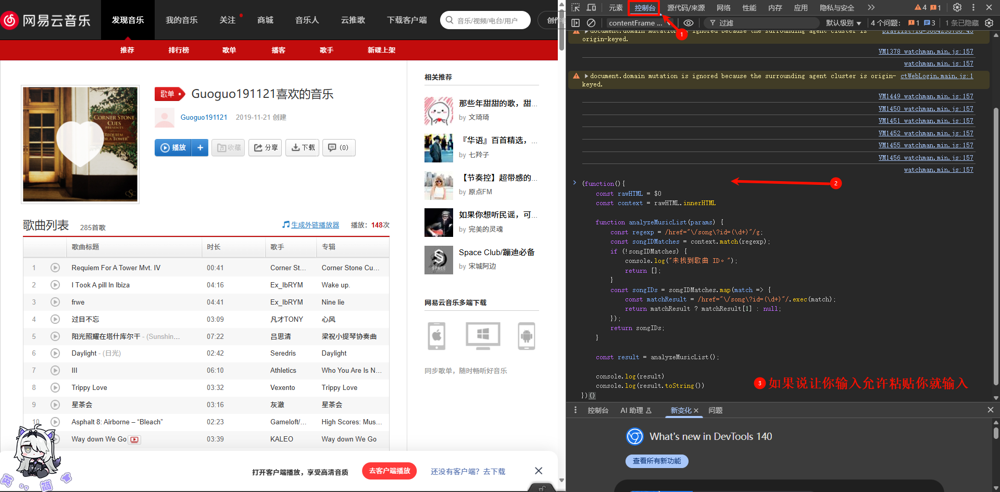
   
   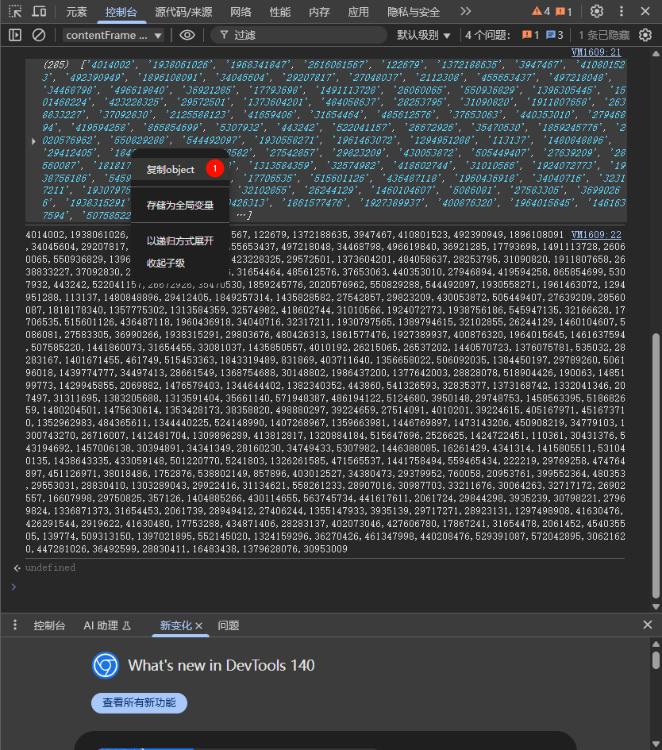

7. 我们将复制的内容保存到本地随便一个地方，命名为`xxx.json`
   
   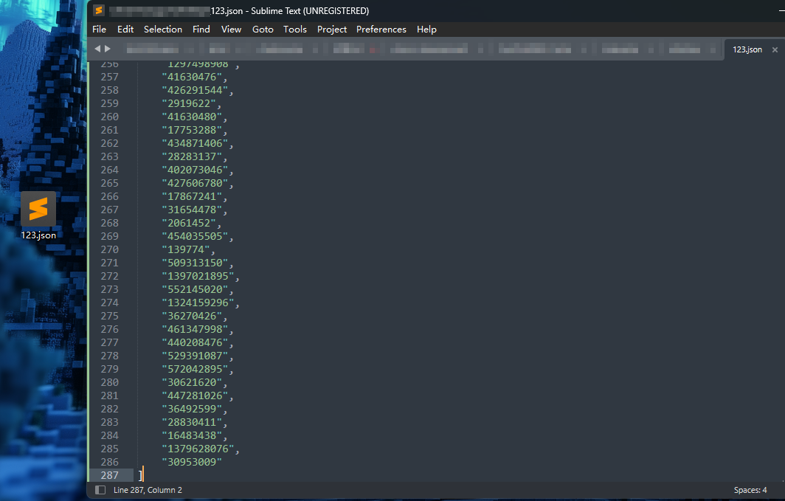

8. 🎉🎉Congratulation！🎉🎉
   
   我们已经成功获取了你的歌单JSON版本，可以进行下一步了！
   
   >  [!TIP]
   > 
   > 这个JSON的内容是与你保存时的歌单同步的，并不存在自动同步最新歌单的功能
   > 
   > 如果需要同步的话，只能手动重新操作一下，目前没有更好的解决办法哦

## 项目下载

给出源码链接：

1. [FSW预览链接]([ChKSz文件分享站](https://chksz.top/123Cloud/BlogFile/CPlayer-Pro))

2. [FSW下载链接](https://chksz.top/d/123Cloud/BlogFile/CPlayer-Pro/CPlayer-Pro-R.zip)

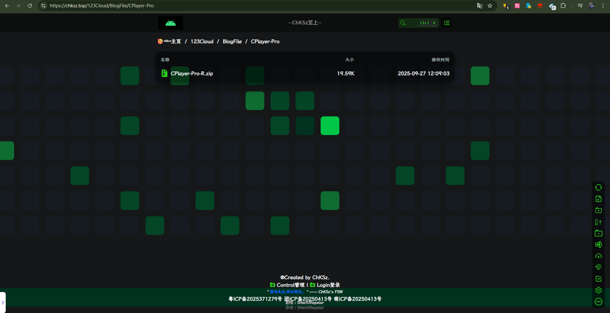  

我们保存到本地并解压，然后就可以双击`index.html`到本地进行游玩了

如果想部署到云端也是可以找静态网站部署的平台（如CF Pages、Netlify等）

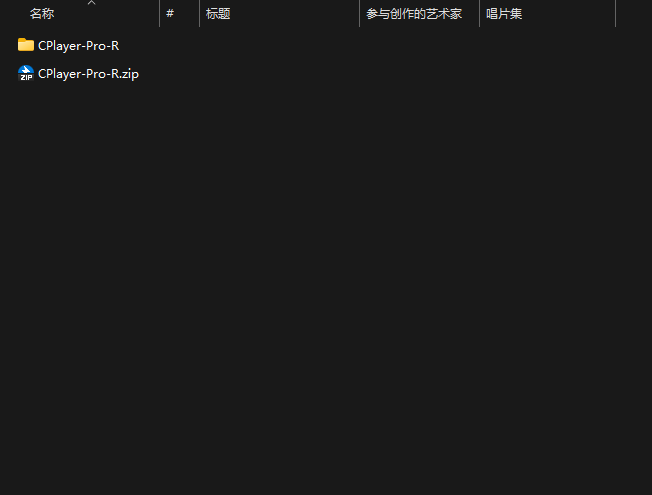

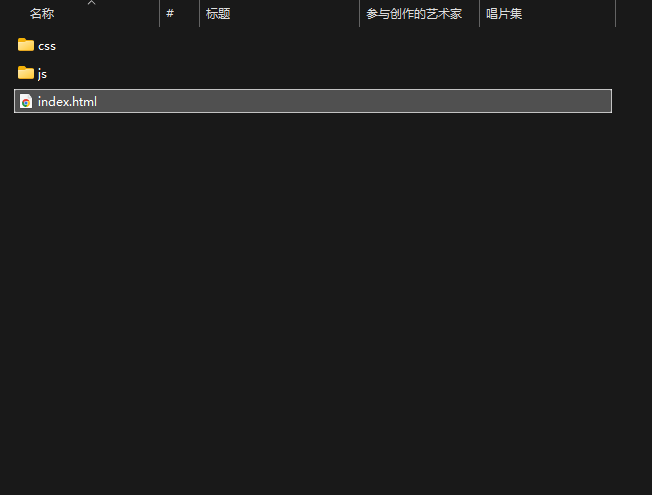

## 歌单导入

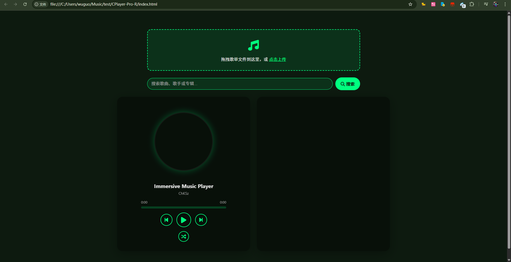

然后我们点击上传歌单

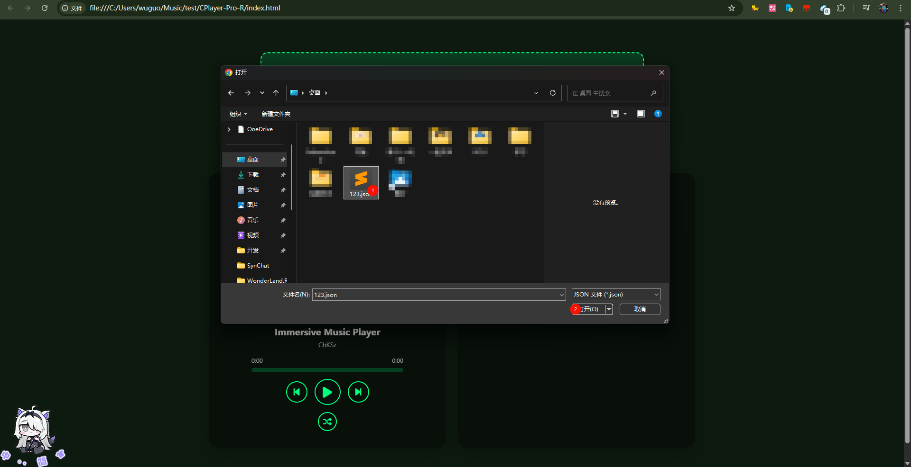

开始享受歌单播放吧！

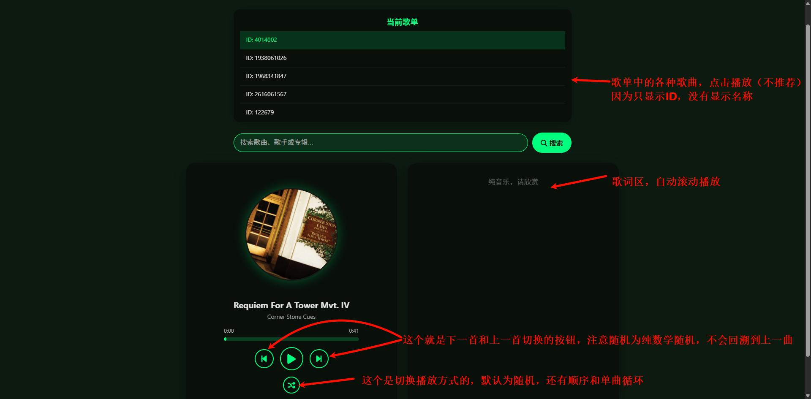

> [!TIP]
> 
> 将你的JSON重命名为`playlist.json`并放在与`index.html`同目录的地方，打开自动播放歌单！
> 
> 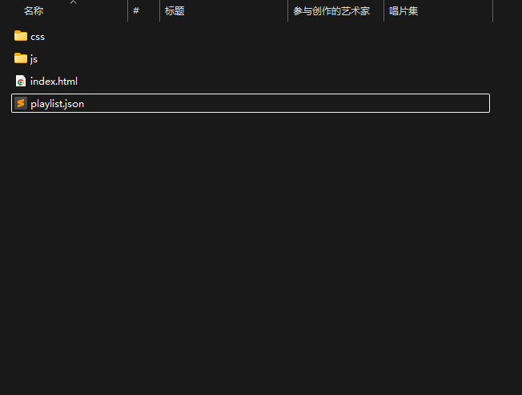
> 
> 注意！！！
> 
> 不能直接打开`index.html`因为静态文件不能侵犯电脑隐私
> 
> 需要运行命令：`python -m http.server` 进行预览
> 
> 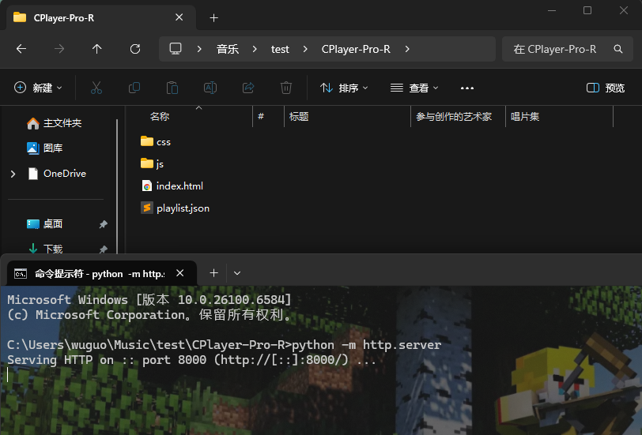
> 
> 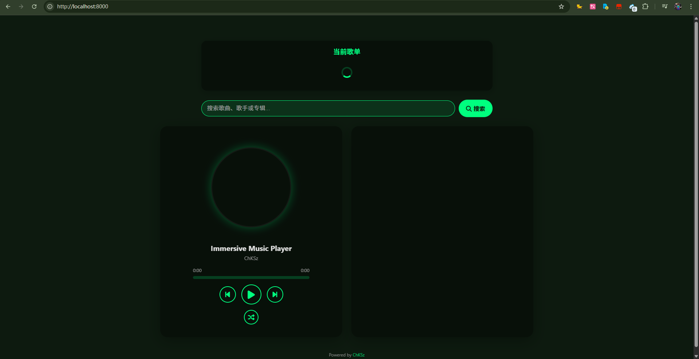
> 
> 需要点击加载的歌单的任意歌曲即可开始播放歌单
> 
> （浏览器防自动播放的限制）

## 单曲播放

除此之外，可以享用原本的单曲搜索播放（可同时进行）

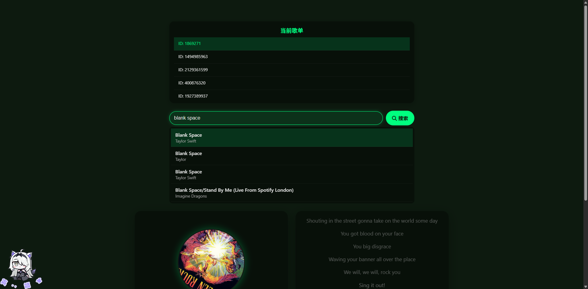

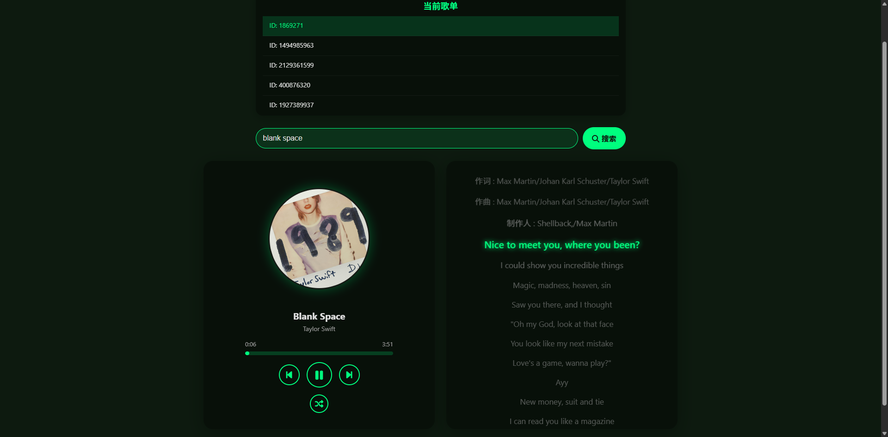

在单曲播放的时候也可以进行切换并且会播放歌单曲目

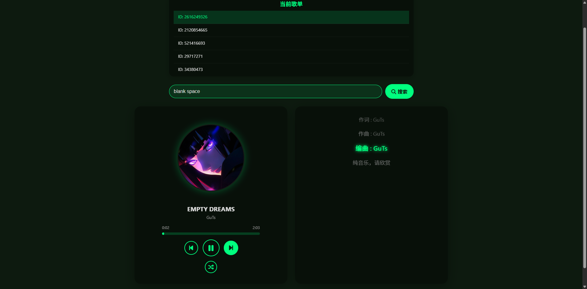

# 结语

这就是本项目`CPlayer-Pro`的所有介绍、使用教程了

如果喜欢的话，欢迎使用！

## 预览链接

无歌单播放的链接：[CPlayer-Pro-R](https://cp.chksz.top)

我的歌单播放链接：[CPlayer-Pro-P](https://cp-p.chksz.top)

> [!TIP]
> 
> （-R=Release(发布版)）
> 
> （-P=Personal(个人定制版)）

这个是使用`EdgeOne-Page`部署的，速度非常可以

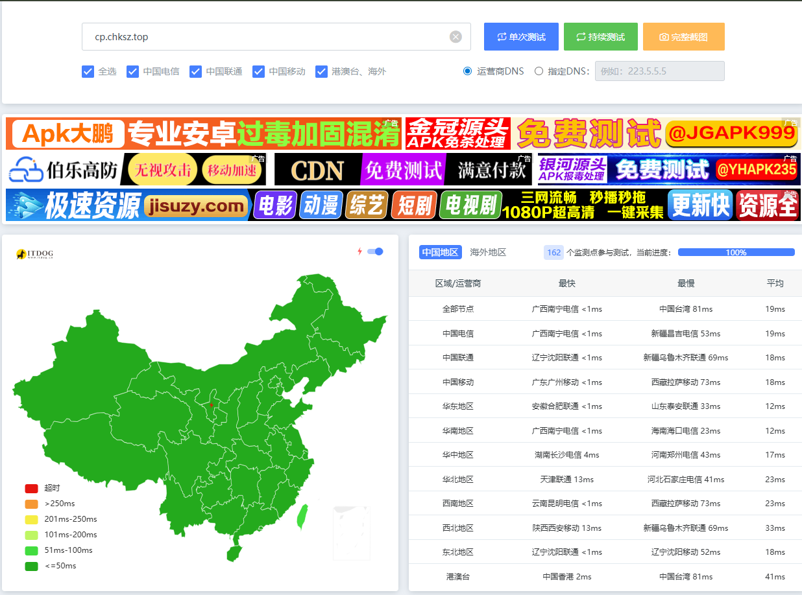


## 谢谢

谢谢！

Thanks♪(･ω･)ﾉ

写了我`2h`，QWQ..
