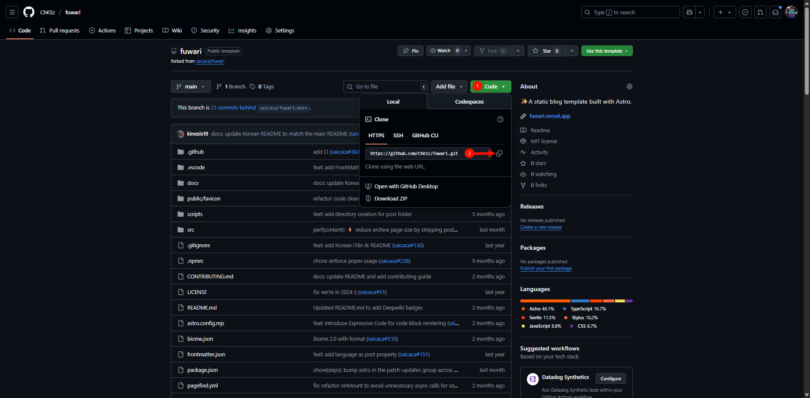

# 前言

OK啊，终于也是出第一期正儿八经的教程了好吧，废话不多说，开干！

## 准备

需要用到的链接以及要求如下：

1. 优异的网络环境

2. [**Github 账号**](https://github.com/signup)

3. [**Netlifly 账号**]([Netlify](https://app.netlify.com/signup))
   
   简单说一下推荐原因：无限制、较快速（比某些CloudFlare是好上不少的）

4. **[安装Git](https://git-scm.com/downloads)**
   
   一路同意即可

5. [**安装Nodejs**](https://nodejs.org/zh-cn/download)
   
   同上

6. **一个域名**，最好是一级域名，二级域名也行其实，但效果体验没那么好

7. 好用的脑子以及准备好跟上教程的心

# 出发

## 1.Fork 仓库

自行注册github，如无邮箱稍等博文

**`#define gh_id=你在github注册的用户名`**

进入[此仓库](https://github.com/saicaca/fuwari)

点击Fork按钮：

之后，你的仓库 

https://github.com/gh_id?tab=repositories

就会多出一个名叫fuwari的仓库：


## 2.搭建本地开发环境

然后我们点进去



按照途中步骤来，我们就会获取到项目的git链接

### Git pull

建立任意文件夹（存放整个项目的）


在地址栏输入cmd按下enter打开命令提示符：


在命令行输入：

```bash
git pull https://github.com/gh_id/fuwari.git
```

替换gh_id哦


然后我们就把项目部署到本地了

## 3.基本配置

恭喜，到这里已经完成大概50%了，可以喝杯水，我们接着下一步！

> [!TIP]
> 
> 以后的路径均为相对于你项目根目录的路径

使用任意文本编辑器打开 `/src/config.ts` 文件，这个就是我们项目的配置文件


> [!NOTE]
> 
> 你们有些代码块可能没有，默认注释是英文的，可以对照我的来，也可以参考下方我的配置

```ts
/**
 * ChKSz's Version
 * 2025/08/14
*/
import type {
    ExpressiveCodeConfig,
    LicenseConfig,
    NavBarConfig,
    ProfileConfig,
    SiteConfig,
} from "./types/config";
import { LinkPreset } from "./types/config";

export const siteConfig: SiteConfig = {
    title: "ChKSz Blog",
    subtitle: "Tech.",
    lang: "zh_CN", // 'en', 'zh_CN', 'zh_TW', 'ja', 'ko', 'es', 'th', 'vi'  语言选择
    themeColor: {
        hue: 200, // 主题颜色的默认色相，范围从0到360。例如：红色: 0, 青色: 200, 青绿色: 250, 粉色: 345  这是默认主题颜色
        fixed: true, // 为访问者隐藏主题颜色选择器
    },
    banner: {
        enable: false,
        src: "assets/images/demo-banner.png", // 相对于/src目录的路径。如果以'/'开头，则相对于/public目录
        position: "center", // 等同于object-position，仅支持'top'、'center'、'bottom'。默认为'center'
        credit: {
            enable: false, // 显示横幅图片的署名文本
            text: "", // 要显示的署名文本
            url: "", // (可选) 原始艺术作品或艺术家页面的URL链接
        },
    },
    toc: {
        enable: true, // 在文章右侧显示目录
        depth: 3, // 目录中显示的最大标题深度，范围从1到3
    },
    comments: {
        enable: true, // 启用或禁用评论系统
    },
    favicon: [
        {
            src: '/favicon/favicon-light-32.png', // favicon的路径，相对于/public目录
            theme: 'light', // 'light' 或 'dark'
            sizes: '32x32', // favicon的尺寸
        },
        {
            src: '/favicon/favicon-dark-32.png', // favicon的路径，相对于/public目录
            theme: 'dark', // 'light' 或 'dark'
            sizes: '32x32', // favicon的尺寸
        },
    ],
};

export const navBarConfig: NavBarConfig = {
    links: [
        LinkPreset.Home,
        LinkPreset.Archive,
        LinkPreset.About,
        {
            name: "赞助",
            url: "/donate/", // 内部链接不应包含基本路径，因为它会自动添加
            external: false, // 显示外部链接图标并在新标签页中打开
        },
    ],
};

export const profileConfig: ProfileConfig = {
    avatar: "assets/images/logo.jpg", // 相对于/src目录的路径。如果以'/'开头，则相对于/public目录
    name: "ChKSz",
    bio: "Life is a maze /.",
    links: [
        {
            name: "X",
            icon: "fa6-brands:x-twitter", // 访问 https://icones.js.org/ 获取图标代码
            // 如果尚未包含相应的图标集，则需要安装它
            // `pnpm add @iconify-json/<icon-set-name>`
            url: "https://x.com/chksz0413",
        },
        {
            name: "GitHub",
            icon: "fa6-brands:github",
            url: "https://github.com/ChKSz",
        },
                {
                        name: 'Email',
                        icon: 'fa6-solid:envelope',
                        url: 'mailto:i@wzg.best',
                },
        {
            name: "Telegram",
            icon: "fa6-brands:telegram",
            url: "https://t.me/chksz0413",
        },
    ],
};

export const licenseConfig: LicenseConfig = {
    enable: true,
    name: "CC BY-NC-SA 4.0",
    url: "https://creativecommons.org/licenses/by-nc-sa/4.0/",
};

export const expressiveCodeConfig: ExpressiveCodeConfig = {
    // 注意：某些样式（如背景色）已被覆盖，请参见astro.config.mjs文件。
    // 请选择深色主题，因为此博客主题目前仅支持深色背景
    theme: "github-dark",
};
```

（有点水字数的嫌疑）

具体的话你们有能力的自己稍微研究一下吧，这个教程也对于0基础还是稍微有一点点困难的哦。

## 4.运行

### 本地部署

**Let's continue;**

装一下`pnpm`：

```bash
npm install -g pnpm
```

然后我们回到项目根目录，打开cmd

依赖安装：

```bash
pnpm install
pnpm add sharp
```

如何在本地 预览/部署 我们的项目？

```bash
pnpm dev
```

访问：

即可打开

> [!TIP]
> 
> 初始项目在`src/content/posts`附带了一些文章，我们可以学习完后删掉或移至别处

### 写作

在项目根目录执行

```bash
pnpm new-post your-title
```

> [!CAUTION]
> 
> 这里不建议用中文作为标题，这个标题其实是类似ID一样的东西。
> 
> 在部署后，此ID会作为URL的一部分，所以不要太长哦。
> 
> e.g. `https://chksz.com/posts/build-fuwari`

然后在根目录下的 `src/content/posts` 文件夹中会多出一个 `your-title.md`文件

打开它，发现里面默认是有内容的

```markdown
title: your-title
published: 2024-10-14
description: ''
image: ''
tags: []
categories: ''
draft: false
lang: ''
```

- title：文章标题

- published：文章创建时间

- description：文章描述，正常会显示在文章标题下面

- image：文章封面图（同目录需要写 `./` 如：`./assets/images/PixPin_2025-08-01_22-53-43.png`）

- tag：文章标签

- categories：文章分类

- draft：是否为草稿（不会发布给公众）

**设：** 写作完成！

接下来就是发布啦~

### 发布到Github

1. 在自己的github仓库中新建一个fuwari-blog

2. git身份认证

```bash
git config --global user.name "gh_id"
git config --global user.email "your@mail.com"
```

2. 初始化git

```bash
git init
```

3. 切换分支

```bash
git checkout -b main
```

4. 推送更改！
   
   这里的commit中绿色的内容为本次修改的描述，可自行修改。

```bash
git remote add origin https://github.com/gh_id/fuwari-blog.git
git add .
git commit -m "init"
git push origin main
```

### 部署到Netlify

这个有空再写吧，急的可以自己搜搜教程。
