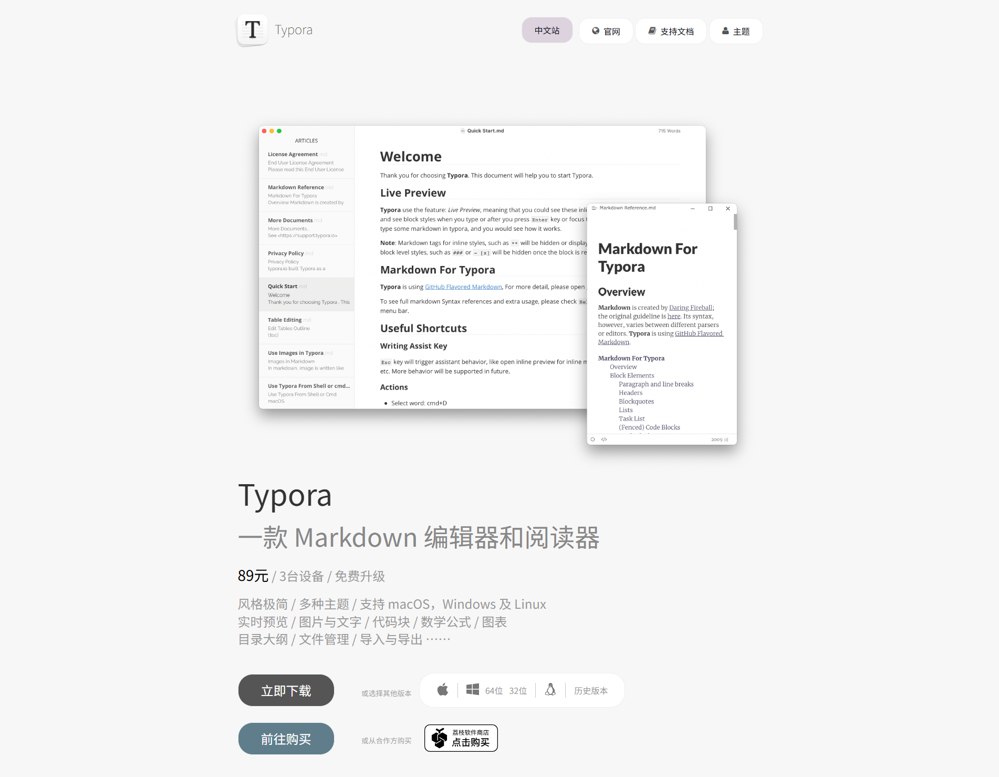
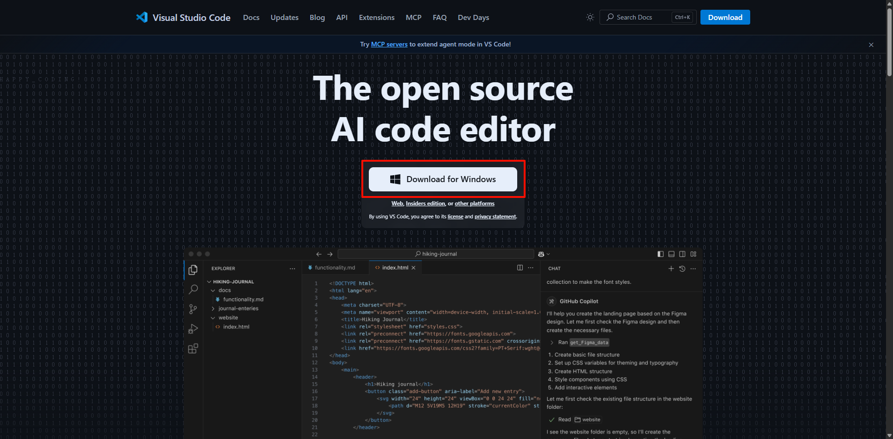
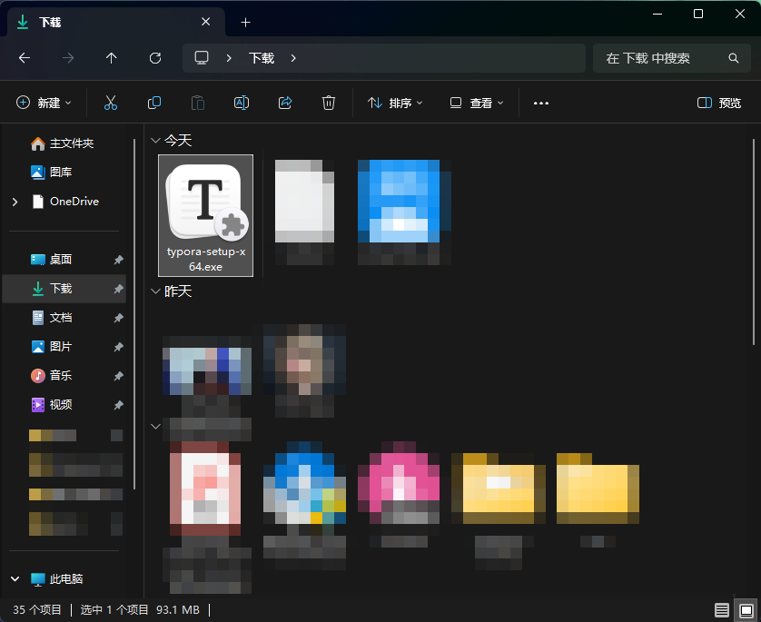
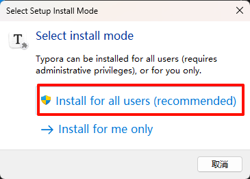
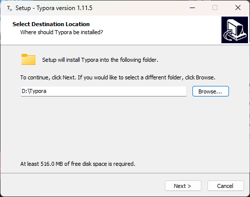
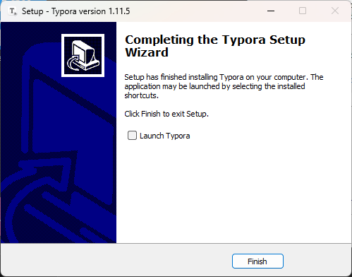
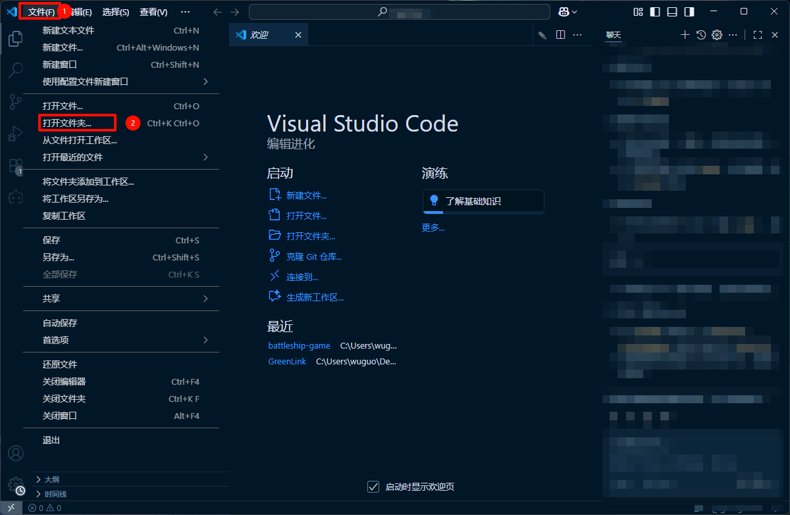
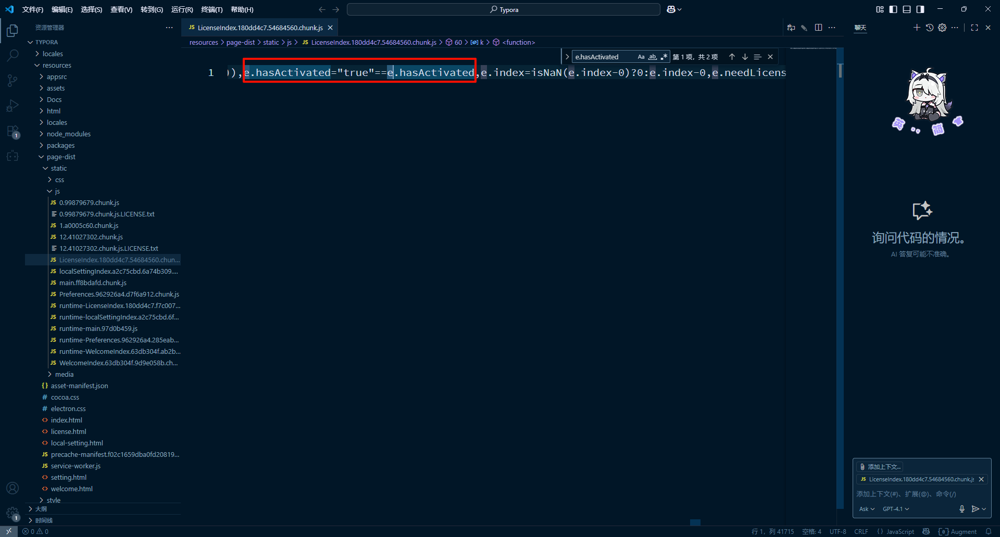
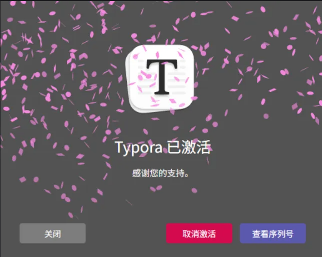

# 一、启程

## 起因

看到有人推荐Typora这个文本编辑器，感觉不错，主要是支持Markdown和LaTeX。

## 官网

我们进入[Typora中文网](https://typoraio.cn/)



然后我们点击立即下载

但是有个缺点：不支持NDM下载，403 Forbidden

所以我传到了我的文件分享站上方便大家快速下载（点击就是下载直链）：

[CFSW-Typora](https://chksz.top/d/CanDoFiles/Win/typora-setup-x64.exe)

## 环境

需要浅浅地安装VS-Code

官网：[VS-Code](https://code.visualstudio.com/)

麻烦大家自行解决



### 汉化

浅浅的教一下：


# 开始

## 安装



双击打开





我这的目录是`D:\Typora`



> [!IMPORTANT]
> 
> 不要勾选Launch Typora
> 
> 也不要打开Typora的进程

## 修改

打开VS Code

然后打开你安装的typora的目录

> [!IMPORTANT]
> 
> 全局搜索：`e.hasActivated`



将

```js
e.hasActivated="true"==e.hasActivated
```

改成

```js
e.hasActivated="true"==true
```

点击`Ctrl + S`保存更改

## 测试

我们打开Typora



成功了！

结束，谢谢♪(･ω･)ﾉ
