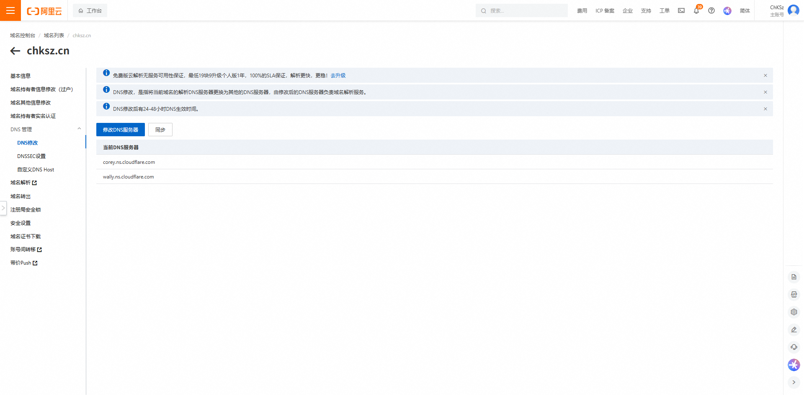

# 起因

主要是我在各平台买了很多域名，所以管理`DNS`记录就很复杂，需要在各大平台来回切换

另外还有一个需求是免费的网页、网站托管（虽然国内速度不是很好，并且最近ban掉了优选，但是不妨碍它还是很牛！）

所以，废话不多说，直接开始！

# 待转移商部分

本文以阿里云的域名为例，`chksz.cn`这个域名是趁着阿里1元cn活动的时候买的（嘻嘻(#^.^#)

我们登录进`aliyun.com`，然后访问：[管理面板](https://home.console.aliyun.com/home/dashboard/ProductAndService)

然后我们点域名，进来

然后点进具体的域名

之后点进DNS修改

进到这个页面我们放着备用

# CloudFlare部分

我们进入[CF](https://dash.cloudflare.com)

没有账号的可以先注册，然后自行登录

我们点击加入域

输入框输入待解析的域名，然后点击继续

> [!CAUTION]
> 
> 注意不要选任何`高级` 选项，别问为啥，问就是要付钱！

咱们的经济仅支持选择Free计划哈（别的必要性也不大）

继续！

这个不管它，确认即可。

> [!CAUTION]
> 
> 划重点！
> 
> 1. 单击复制第一个DNS服务器的地址
> 
> 2. 
>    
>    然后我们粘贴进来
> 
> 3. 
>    
>    输入第二个地址
> 
> 4. 确认
> 
> 5. 
>    
>    这里需要手机号验证一下就可以了
> 
> 6. 
>    
>    回到cf，往下滑，立即检查名称服务器
>    
>    
> 
> 7. 多刷新几次就可以生效了
>    
>    

# 结语

到此，我们就成功地将`chksz.cn`添加到了`CloudFlare`了，让我们畅享它的免费服务吧！以后会出一些使用`Workers & Pages`的教程哦，敬请期待！有问题可以在下方评论区留言哦！
